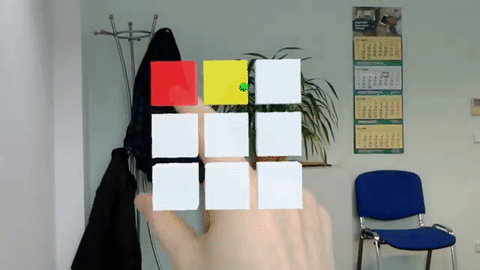

= HandInteraction

Using HoloLens with Hand Input ---  some Scripts for Unity

This Unity 5.50f3 Project contains some script and a Sample Scene. 
Hand Interaction can be used (instead of gaze) to interact with Objects.

In Action:

